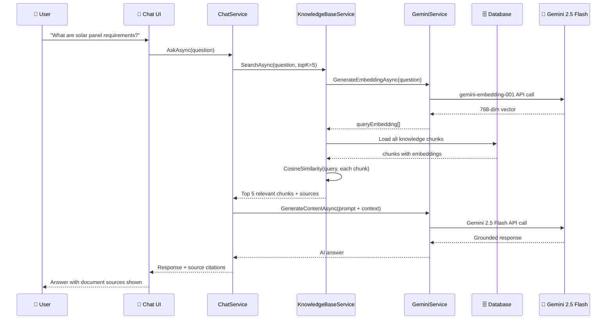
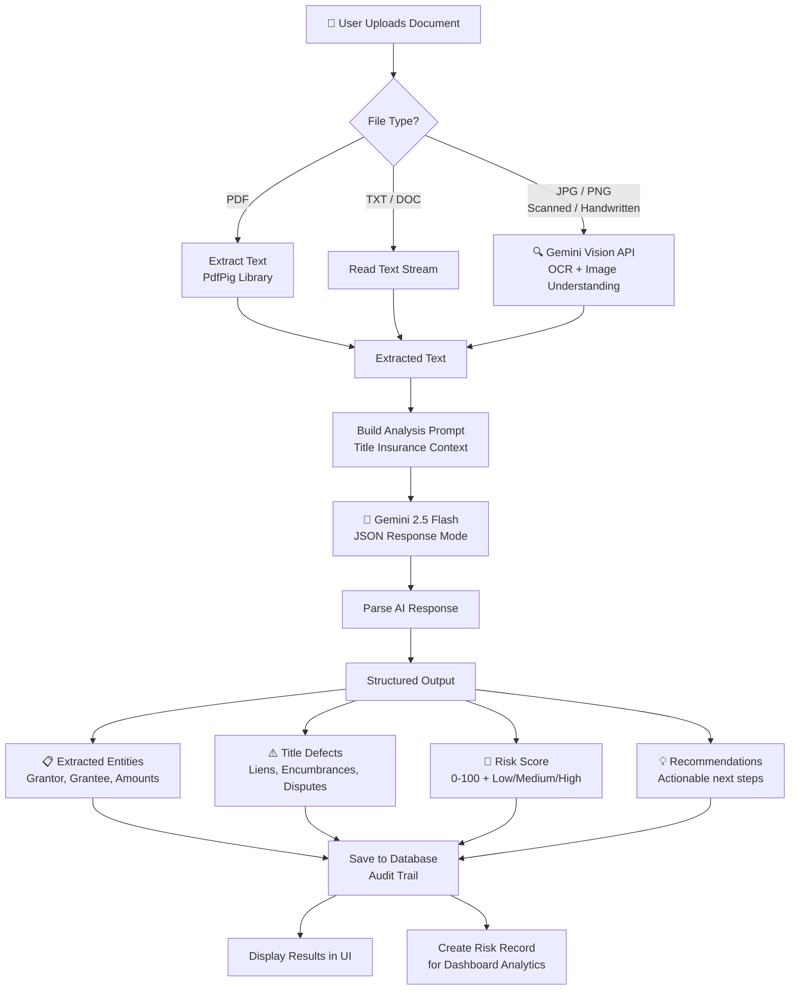
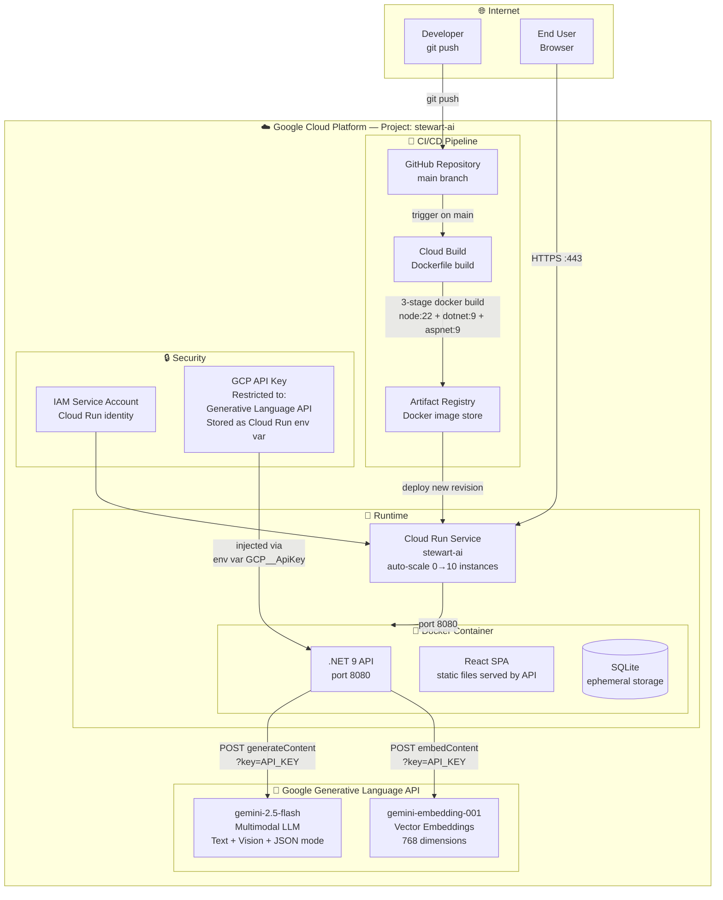
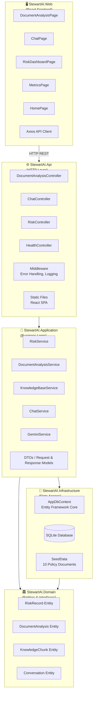
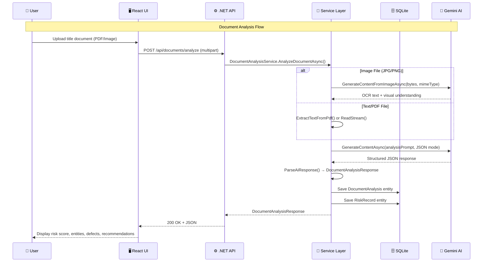
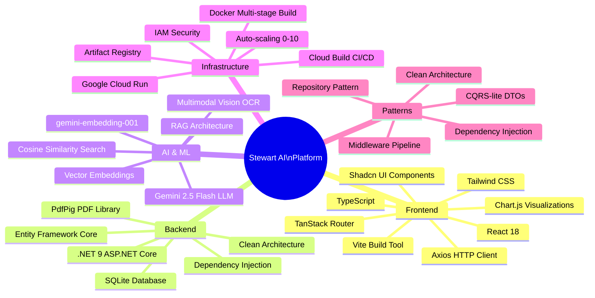
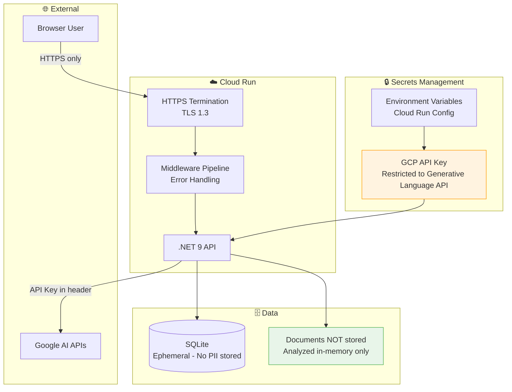
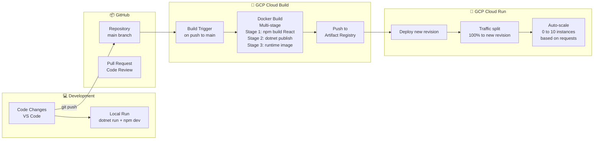

# Architecture Design — Stewart AI Platform
## Stewart India TBS AI Ideathon 2026

> **Verified against source code** — all diagrams cross-checked with actual implementation.

---

## 1. High-Level System Architecture

```mermaid
graph TB
    subgraph Users["👥 Users"]
        UA[Title Examiner]
        UB[Underwriter]
        UC[Field Agent]
    end

    subgraph Frontend["🖥️ Frontend — React + Vite + TypeScript"]
        F1[🏠 Home / Landing Page]
        F2[📄 Document Intelligence]
        F3[💬 AI Chat Assistant]
        F4[📊 Risk Dashboard]
        F5[📈 Metrics & Audit Trail]
    end

    subgraph Backend["⚙️ Backend — .NET 9 Clean Architecture"]
        B1[DocumentAnalysisController]
        B2[ChatController]
        B3[RiskController]
        B4[HealthController]
    end

    subgraph AppLayer["🧠 Application Layer — Services"]
        S1[DocumentAnalysisService]
        S2[ChatService]
        S3[KnowledgeBaseService]
        S4[RiskService]
        S5[GeminiService]
    end

    subgraph Data["🗄️ Data Layer"]
        DB[(SQLite Database)]
        KB[Knowledge Base\nVector Store]
        SD[Seed Data\n10 Policy TXT Files]
    end

    subgraph GCP["☁️ Google Cloud Platform"]
        GR[Cloud Run\nAuto-scaling Container]
        GAI[Gemini 2.5 Flash\nMultimodal LLM]
        GEM[gemini-embedding-001\nVector Embeddings\n(768-dim)]
        GCB[Cloud Build\nCI/CD Pipeline]
        GAR[Artifact Registry\nDocker Images]
    end

    UA & UB & UC --> Frontend
    Frontend --> Backend
    Backend --> AppLayer
    AppLayer --> Data
    AppLayer --> GCP
    S5 --> GAI
    S5 --> GEM
    GR --> Backend
    GCB --> GAR --> GR
```

---

## 2. RAG (Retrieval-Augmented Generation) Flow



---

## 3. Document Intelligence Flow



---

## 4. Risk Assessment Engine

```mermaid
flowchart LR
    subgraph Input["📥 Input Parameters"]
        I1[State / County]
        I2[Property Type\nResidential / Commercial]
        I3[Transaction Type\nPurchase / Refinance / Foreclosure]
        I4[Purchase Price]
        I5[Loan Amount]
        I6[Additional Context]
    end

    subgraph AI["🤖 Gemini AI Analysis"]
        P1[Build Risk Prompt\nTitle Insurance Expert Role]
        P2[Gemini 2.5 Flash\ntemp=0.3 for consistency]
        P3[JSON Response Parsing]
    end

    subgraph Output["📤 Risk Output"]
        O1[Overall Risk\nLow / Medium / High]
        O2[Risk Score\n0-100 numeric]
        O3[Risk Factors\nGeographic / Transaction / Market / Legal]
        O4[Recommendations\nActionable steps]
        O5[Summary\n2-3 sentence analysis]
    end

    subgraph Dashboard["📊 Aggregated Analytics"]
        D1[2000 Synthetic Records\nSeeded on startup]
        D2[Risk by State\nHeatmap visualization]
        D3[Claim Rate\nHistorical trends]
        D4[Risk Distribution\nLow / Medium / High pie chart]
    end

    Input --> AI
    AI --> Output
    Output --> Dashboard
```



---

## 5. GCP Cloud Infrastructure



---

## 6. Clean Architecture — Code Structure



---

## 7. Data Flow — End to End



---

## 8. Technology Stack Summary



---

## 9. Security Architecture



---

## 10. Deployment Architecture



---

## Summary: What the Architecture Achieves

| Capability | How |
|---|---|
| **Multimodal AI** | Gemini 2.5 Flash processes text + images in one API call |
| **Semantic Search** | gemini-embedding-001 creates 768-dim vectors, cosine similarity finds relevant chunks |
| **RAG** | Knowledge base chunks retrieved and injected into every chat prompt |
| **Scalability** | Cloud Run scales from 0 to 10 instances automatically |
| **Zero Downtime Deploy** | Cloud Build → Artifact Registry → Cloud Run revision rollout |
| **No Data Leakage** | Documents analyzed in-memory, never persisted to disk |
| **Audit Trail** | Every AI decision saved to SQLite with timestamp and metadata |
| **Clean Code** | 4-layer Clean Architecture: Domain → Application → Infrastructure → API |

---

*Architecture designed for Stewart India TBS AI Ideathon 2026*  
*Live Demo: https://stewart-ai-219046022543.us-central1.run.app*
