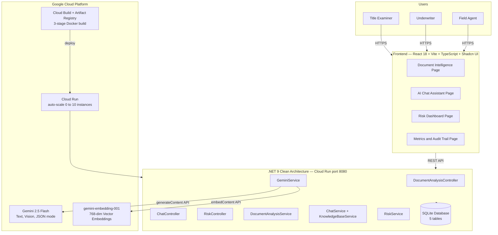
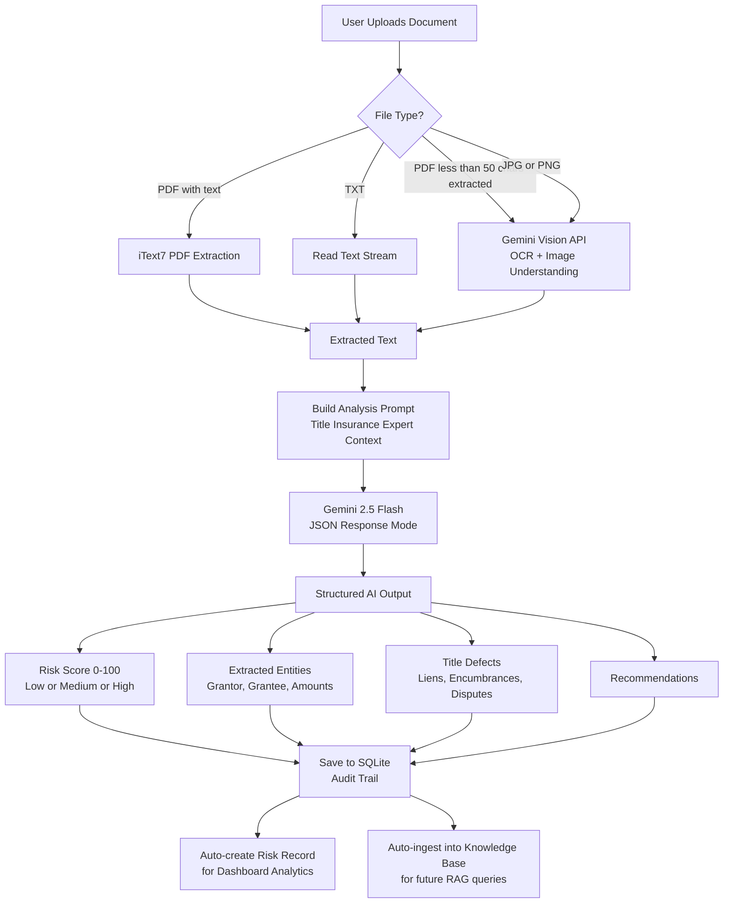
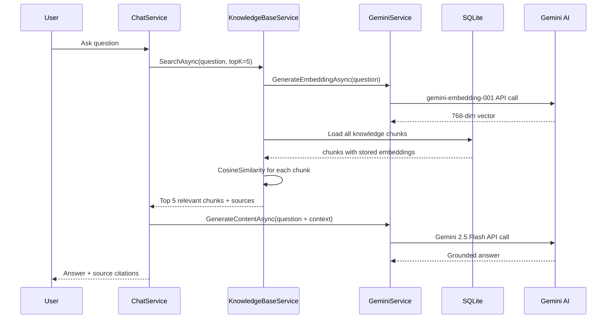

# Architecture Design — Stewart AI Platform
## Stewart India TBS AI Ideathon 2026

---

## 1. Full Stack Architecture

---

## 2. Document Intelligence Flow

---

## 3. RAG Chat Flow

---

## Summary

| Capability | Implementation |
|---|---|
| **Multimodal AI** | Gemini 2.5 Flash processes text + images in one API call |
| **Semantic Search** | gemini-embedding-001 creates 768-dim vectors, cosine similarity finds relevant chunks |
| **RAG** | Top-5 knowledge base chunks injected into every chat prompt |
| **Intelligence Loop** | Document analysis auto-creates risk record AND auto-ingests into knowledge base |
| **Scalability** | Cloud Run scales from 0 to 10 instances automatically |
| **Audit Trail** | Every AI decision saved to SQLite with timestamp and metadata |
| **Clean Architecture** | 4-layer: Domain, Application, Infrastructure, API |

---

*Live Demo: https://stewart-ai-219046022543.us-central1.run.app*
