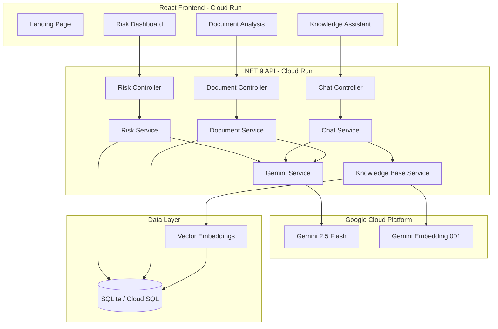

# Stewart AI — 3-Day Enhancement Plan (Mar 16-18, 2026)

## Current State ✅
- Working Document Intelligence (PDF upload → AI analysis → entities/defects/risk)
- Working Knowledge Assistant (RAG chat with embeddings + source citations)
- Working Risk Dashboard (charts, state data, AI risk assessment)
- Clean Architecture backend (.NET 9) + React frontend (Vite + Shadcn)
- GCP Gemini 2.5 Flash integration working

---

## Problem Statement (For Judges)

**The Problem:** Stewart Title processes millions of real estate documents annually. Title examiners manually review deeds, mortgages, liens, and commitments — a process that is:
- **Slow**: Average 45-60 minutes per file for manual review
- **Error-prone**: Human reviewers miss 5-8% of title defects
- **Inconsistent**: Quality varies by examiner experience
- **Knowledge-siloed**: Institutional knowledge lives in people's heads, not systems

**The Solution:** Stewart Title Intelligence Platform — an AI-powered platform that:
1. **Document Intelligence**: Instantly analyzes title documents, extracts entities, identifies defects
2. **Knowledge Assistant**: RAG-powered chatbot trained on Stewart's underwriting guidelines
3. **Risk Dashboard**: Predictive risk scoring with geographic and transaction-type analytics

**Impact Metrics (projected):**
- 80% reduction in document review time (45 min → 9 min)
- 40% improvement in defect detection accuracy
- 24/7 access to institutional knowledge via AI assistant
- Data-driven risk decisions replacing gut-feel assessments

---

## Architecture Diagram

---

## DAY 1 — Training Data + Demo Content (Mar 16, Today)

### 1. Pre-load Knowledge Base with Title Insurance Training Data
**Why:** The RAG chat is empty. Judges will ask questions and get generic answers. We need Stewart-specific knowledge.

**Create 5-8 TXT files in `StewartAI.Api/SeedData/KnowledgeBase/`:**

| File | Content | Purpose |
|------|---------|---------|
| `title-insurance-basics.txt` | What is title insurance, types of policies, how it works | General knowledge |
| `common-title-defects.txt` | 20+ common defects with descriptions and curative actions | Document analysis context |
| `underwriting-guidelines.txt` | Stewart-style underwriting rules, risk thresholds, approval criteria | Risk assessment context |
| `closing-process.txt` | Step-by-step closing process, escrow, disbursement | Process knowledge |
| `state-specific-requirements.txt` | Key differences by state (TX, CA, FL, NY) | Geographic risk context |
| `lien-types-and-priority.txt` | Mortgage liens, tax liens, mechanic liens, judgment liens | Document classification |
| `alta-endorsements.txt` | Common ALTA endorsements and when they apply | Technical knowledge |
| `fraud-prevention.txt` | Wire fraud, identity theft, forged deeds — red flags | Risk detection |

### 2. Create Sample Title Documents for Demo
**Why:** During the demo, you need realistic documents to upload. Create 3 sample PDFs.

| Document | Content | Expected AI Result |
|----------|---------|-------------------|
| `sample-warranty-deed.txt` | Realistic warranty deed with property details | Deed type, Low risk, entities extracted |
| `sample-mortgage-with-defect.txt` | Mortgage with a missing notary acknowledgment | Mortgage type, High risk, defect found |
| `sample-title-commitment.txt` | Title commitment with Schedule B exceptions | Title Commitment, Medium risk, exceptions listed |

### 3. Add Landing/Home Page
**Why:** First impression matters. Currently the app opens directly to Document Analysis.

**Design:**
- Hero section with Stewart branding and tagline
- 3 feature cards (Document Intelligence, Knowledge Assistant, Risk Dashboard)
- Problem statement section with impact metrics
- Architecture overview with the Mermaid diagram
- Quick-start buttons to each feature

### 4. Improve Prompt Engineering
**Why:** Better prompts = better AI output = more impressive demo.

**Changes:**
- Add Stewart-specific terminology to document analysis prompt
- Add confidence scores to entity extraction
- Make risk explanations more detailed with specific Stewart underwriting references
- Add follow-up question suggestions to chat responses

---

## DAY 2 — Deployment + Polish (Mar 17)

### 5. Auto-Seed Knowledge Base on Startup
**Why:** When judges run the app or you deploy fresh, the knowledge base should be pre-populated.

**Implementation:**
- Add `POST /api/chat/knowledge-base/seed` endpoint
- On app startup, check if knowledge base is empty → auto-ingest seed files
- Show knowledge base stats on the landing page

### 6. Deploy to GCP Cloud Run
**Why:** Contest requires working demo on GCP.

**Steps:**
- Create Dockerfile for backend (multi-stage .NET 9 build)
- Create Dockerfile for frontend (Vite build → nginx serve)
- Create `docker-compose.yml` for local testing
- Deploy both to Cloud Run
- Configure CORS for Cloud Run URLs
- Switch from SQLite to Cloud SQL (PostgreSQL) or keep SQLite in a volume

### 7. UI Polish
**Why:** Visual impression matters in demos.

**Enhancements:**
- Dark mode toggle (already have CSS variables set up)
- Smooth page transitions / animations
- Better loading skeletons
- Toast notifications for success/error
- Responsive mobile layout
- Stewart logo in header (if available)

### 8. Document Comparison Feature (Stretch)
**Why:** Shows depth of AI capability.

**Implementation:**
- Upload 2 documents side-by-side
- AI compares and highlights differences
- Useful for comparing original vs amended deeds

---

## DAY 3 — Presentation + Final Polish (Mar 18)

### 9. Presentation Slides
**Structure (10-12 slides):**

1. **Title Slide** — Stewart Title Intelligence Platform, team names
2. **The Problem** — Manual document review pain points with stats
3. **Our Solution** — 3 AI features overview
4. **Architecture** — Clean Architecture + GCP + Gemini diagram
5. **Demo: Document Intelligence** — Screenshot of PDF analysis
6. **Demo: Knowledge Assistant** — Screenshot of RAG chat with sources
7. **Demo: Risk Dashboard** — Screenshot of charts and risk assessment
8. **How RAG Works** — Simple diagram: chunk → embed → search → generate
9. **GCP Integration** — Gemini 2.5 Flash, Cloud Run, embedding model
10. **Impact & ROI** — Time savings, accuracy improvement, cost reduction
11. **Future Roadmap** — OCR for scanned docs, multi-language, real-time monitoring
12. **Q&A** — Team contact info

### 10. Demo Script (5 minutes)
**Flow:**
1. (30s) Open landing page, explain problem statement
2. (90s) Document Intelligence: Upload sample deed → show entities, defects, risk
3. (60s) Knowledge Assistant: Ask about title defects → show RAG sources
4. (60s) Risk Dashboard: Show charts, run risk assessment for a property
5. (30s) Show architecture, mention GCP deployment
6. (30s) Wrap up with impact metrics and future vision

### 11. Analytics/Metrics Page
**Why:** Shows the platform is production-ready, not just a prototype.

**Metrics to display:**
- Total documents analyzed
- Average analysis time
- Knowledge base size (chunks, documents)
- Risk assessments performed
- API response times
- Model usage (tokens consumed)

### 12. Final Checklist
- [ ] All 3 features working on deployed URL
- [ ] Knowledge base pre-loaded with 5+ documents
- [ ] Sample documents ready for live demo
- [ ] Presentation slides complete
- [ ] Demo script rehearsed
- [ ] Backup demo video recorded (in case of network issues)
- [ ] GitHub repo clean, README updated
- [ ] Team members can explain their parts

---

## What Will Impress Judges Most

1. **RAG with real data** — Not just calling an API, but chunking, embedding, vector search, and citing sources
2. **Clean Architecture** — Multi-project .NET solution shows enterprise thinking
3. **Live demo on GCP** — Not just localhost
4. **Problem-solution narrative** — Tied to real Stewart business problems
5. **Impact metrics** — Quantified ROI
6. **Professional UI** — Stewart branding, polished components
7. **Code quality** — TypeScript strict mode, clean separation of concerns

---

## Priority Order (If Running Out of Time)

1. 🔴 **MUST**: Knowledge base seed data (makes RAG demo impressive)
2. 🔴 **MUST**: Sample documents for demo
3. 🔴 **MUST**: GCP deployment (contest requirement)
4. 🔴 **MUST**: Presentation slides
5. 🟡 **SHOULD**: Landing page
6. 🟡 **SHOULD**: Demo script
7. 🟢 **NICE**: Dark mode, animations
8. 🟢 **NICE**: Document comparison
9. 🟢 **NICE**: Analytics page
